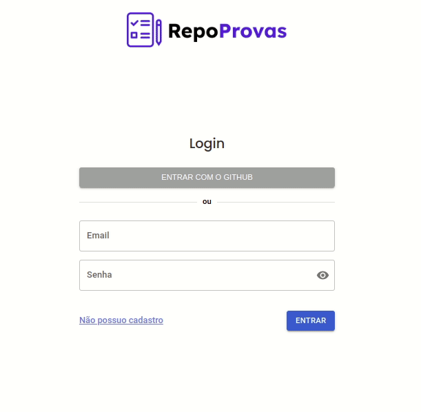

# RepoStore

## 💻 Projeto

No RepoProvas qualquer pessoa pode procurar provas antigas de suas disciplinas e professores ou enviar provas antigas para ajudar os calouros.

---

## ⚙️ Funcionalidades

- [x] Os usuários tem acesso a plataforma web enviando:

    - [x] email
    - [x] senha

- [x] Dentro da aplicação os usuários podem:

    - [x] visualizar provas por disciplinas
    - [x] visualizar provas por instrutores
    - [x] filtrar provas por nome de disciplina ou instrutor
    - [x] adicionar uma nova prova
    - [x] clicar na prova e contabilizar o seu view

## 🎨 Layout

O layout da aplicação está disponível no Figma:

<p>
<a href="https://www.figma.com/file/VsURuIO8j4VGsdEZKdUva6/RepoProvas">
  
</a>
</p>

<a href="https://www.figma.com/file/VsURuIO8j4VGsdEZKdUva6/RepoProvas">
  
</a>

## 🚀 Como executar o projeto

Este projeto está dividido em duas partes:

1. [Backend](https://github.com/yaratavares/API-RepoProvas) 🎲
2. Frontend (este repositório)

💡 O front-end não precisa que o back-end esteja rodando para funcionamento da aplicação.

Para ver as funcionalidades basta acessar o último deploy ou clicar no link da [página](repo-provas-lilac.vercel.app).

### Pré-requisitos

Para rodar a aplicação na sua máquina, você vai precisar ter instalado em sua máquina as seguintes ferramentas:
[Git](https://git-scm.com), [Node.js](https://nodejs.org/en/).
Além disto é bom ter um editor para trabalhar com o código como [VSCode](https://code.visualstudio.com/).

#### 🧭 Rodando a aplicação web (Front-end)

```bash
# Clone este repositório
$ git clone git@github.com:yaratavares/RepoProvas.git
# Vá para a pasta da aplicação e instale as dependências
$ npm install
# Execute a aplicação em modo de desenvolvimento
$ npm run start
# A aplicação será aberta na porta:3000 - acesse http://localhost:3000
```
## 🛠 Tecnologias

As seguintes ferramentas foram usadas na construção do projeto:

### Front-end

<p >
<a src="https://reactjs.org/">
 </a><a src="https://github.com/ReactTraining/react-router/tree/master/packages/react-router-dom"></a> <a src="https://styled-components.com/"></a>
<a src="https://axios-http.com/"></a>
<a src='https://mui.com/pt/'>

</a> 
<a src="https://mhnpd.github.io/react-loader-spinner/"></a> <a src="https://react-hot-toast.com/"></a> 
<a src="https://reactjs.org/">
 </a>
<a src='https://docs.cypress.io/'>

</a>
</p>


> Veja o arquivo [package.json](./package.json)
### Back-end

<p>
<a src="https://nodejs.org/en/"></a>
<a src="https://expressjs.com/pt-br/"></a>
<a src="https://www.postgresql.org/"></a>
<a src='https://www.prisma.io/docs/'>

</a>
<a src="https://https://day.js.org/"></a>
<a src="https://joi.dev/"></a>
<a src="https://github.com/expressjs/cors"></a>
<a src="https://github.com/motdotla/dotenv"></a>
<a src='https://jestjs.io/docs/next/getting-started'>

</a>
</p>

> Veja o arquivo [package.json](https://github.com/yaratavares/API-RepoProvas/blob/main/package.json)

## 🧜‍♀️ Autora

<a href="https://www.linkedin.com/in/yaracristinatavares/" >
 
 <p>Yara Tavares 🚀</p>
</a>

---

## 📝 Licença

Este projeto esta sobe a licença [MIT](./LICENSE).
